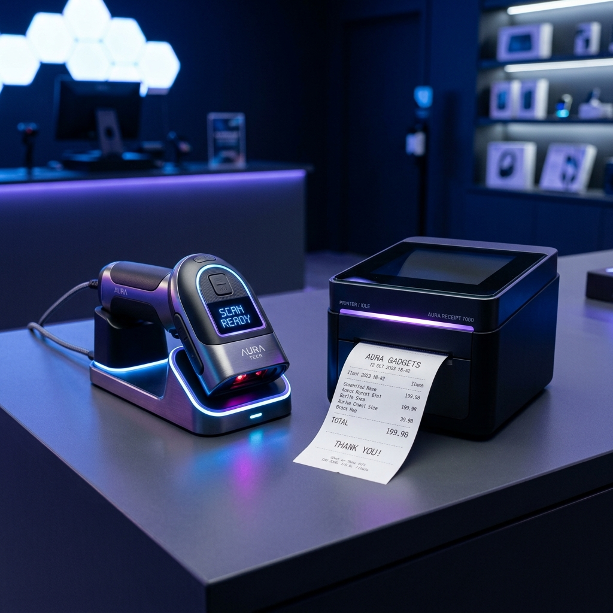

# Computronix
### By Alpha Soft

Welcome to the Computronix project repository! This system is a powerful POS and business management solution designed for seamless operations.

## 📸 Glimpses from our Instagram
Here are some of the latest updates and setups from our system:

  
  

 

  
  

> Follow us on our journey and see more on our [Instagram Page](https://www.instagram.com/computronix_sarl/).

## 🚀 Features
- **Point of Sale (POS)**
- **Inventory Management**
- **Accounting & Finance**
- **Analytics & Reporting**

---
*Built with ❤️ in Zahlé, Lebanon.*
